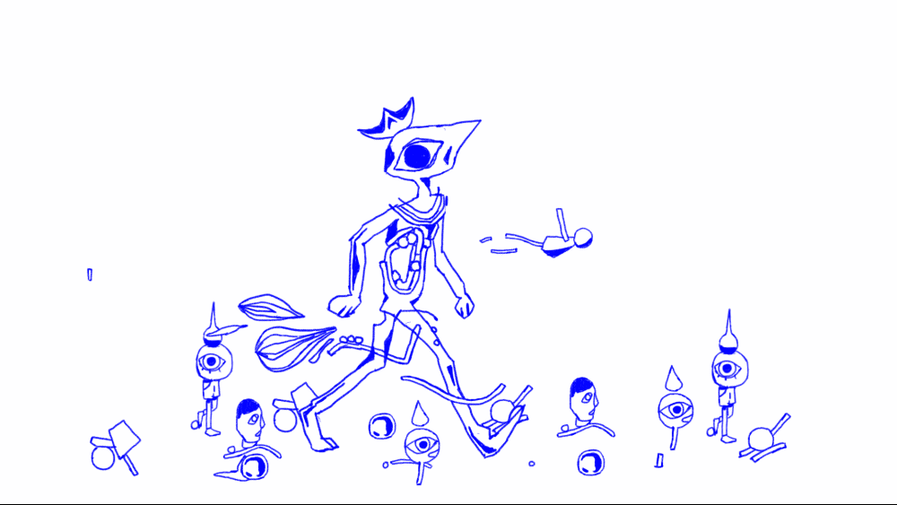

<section class="grid grid-cols-6 gap-4 mt-16 mb-32">
<h1 class="col-start-2 col-span-4 text-4xl">What if a character's gender could change?</h1>

In the best stories we see ourselves in the characters we encounter.  Their identity can become our own or at least a new way of seeing ourselves.

Names, genders, pronouns, and titles make up a character’s basic identity. Each attribute presents a history, roles, constraints, and heirarchy. Mix in actions and power dynamics are revealed, reinforced, or reinvented. One action taken by a man can be read differently as the same action taken by a woman. 

I want 

I hope this project helps create new expereinces, questions, and understandings.

</section>
<section class="grid grid-cols-6 gap-4 my-32">
	<h2 class="col-start-2 col-span-4 text-4xl">Pride & Prejudice: Regendered in Four Ways</h2>
	

		

			

				
Book Title

			

		

		<button class="btn-white mt-16 px-14">Pre-order a box set for $50</button>
	

</section>

<section class="grid grid-cols-6 gap-4 my-28">
	<blockquote class="col-start-2 col-span-4 text-5xl leading-relaxed">“A gender-equal society would be one where the word 'gender' does not exist: where everyone can be themselves.” — Gloria Steinem</blockquote>
</section>

<section class="grid grid-cols-6 gap-4 my-32">
	<h2 class="col-start-2 col-span-4 text-4xl">Contribute to The Project</h2>
	
We’d love help improving this project. Finding matching pronouns for characters (coreferencing) across an entire book is complicated. Working on this project made me realize how much I take that simple ability for granted when I read.

If you know Python, are familiar with Natural Language Processing, and know your way around Git then you can help.

We’re focused on these top three challenges:

	<ol class="col-start-2 col-span-4 list-decimal text-xl leading-relaxed list-inside">
		<li class="pb-4">Multiple character identification.</li>
		<li class="pb-4">Cleaner character coreference identification in paragraphs with multiple characters of the same original gender.</li>
		<li>Making this project accessible on the web for more humans.</li>
	</ol>
	<button class="col-start-2 col-span-2 btn-blue mt-10">Check out the Github Repository</button>
</section>

<section class="grid grid-cols-6 gap-4 my-32">
	<h2 class="col-start-2 col-span-4 text-4xl mb-8">Acknowledgement & Thanks</h2>
	
🤗 Hugging Face for their Neural Coreference Resolution System

	
Kyle Turman for design feedback on this site

</section>
